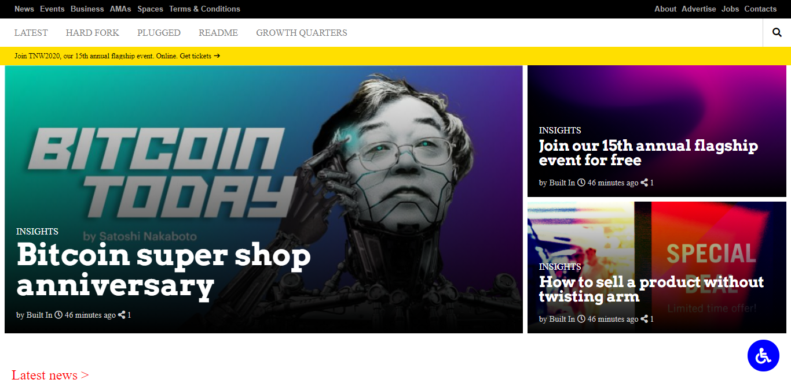

# The Next Web
> This project consists of replicating the ["The Next Web"](https://thenextweb.com/) website putting emphasis on how it behaves differently depending on the size of the screen where the website is rendered.



## Project Requirements

### General
- You can find the original project specification at [The Odin Project](https://www.theodinproject.com/courses/html5-and-css3/lessons/building-with-responsive-design).

### Specific to Microverse
- Align all elements with ```float``` and ```flex``` or ```grid```.
- Use a mobile first approach when dealing with mediaqueries with 2 breakpoints (you should figure out the exact width for each breakpoint by yourself).
- Remember to double-check if you page layout does not brake on smaller screens.

## Built With

- HTML
- CSS

## Dependencies

> Refer to [Linters Config](https://github.com/eananti/linters-config/tree/master/html-css) for project setup guide.

## Live Demo

[Live Demo Link](https://eananti.github.io/The-Next-Web/)

## Authors

👤 **Author1**

- Github: [@eananti](https://github.com/eananti)
- Twitter: [@e_ananti](https://twitter.com/e_ananti)
- Linkedin: [Emeka Ananti](https://www.linkedin.com/in/emekaananti/)

👤 **Author2**

- Github: [@sneeu-leeu](https://github.com/sneeu-leeu)
- Twitter: [@Stephan07484055](https://twitter.com/Stephan07484055)
- Linkedin: [Stephan Annandale](https://www.linkedin.com/in/stephan-annandale-a4b4931a9/)

## Show your support

Give a ⭐️ if you like this project!
